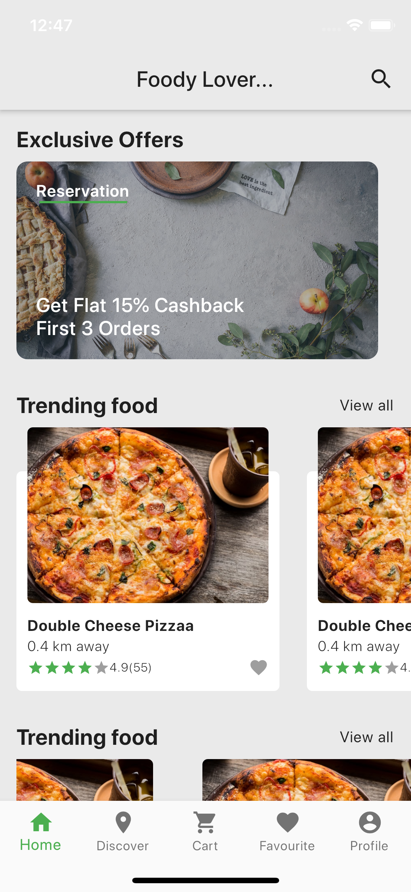
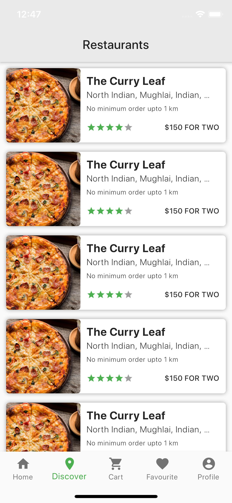
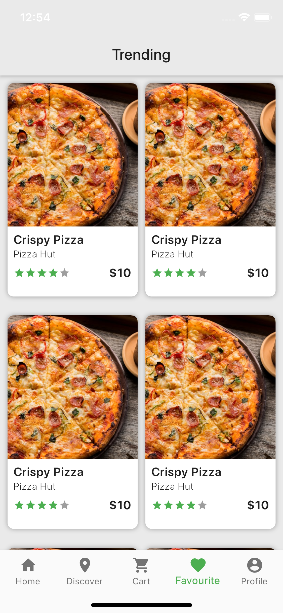
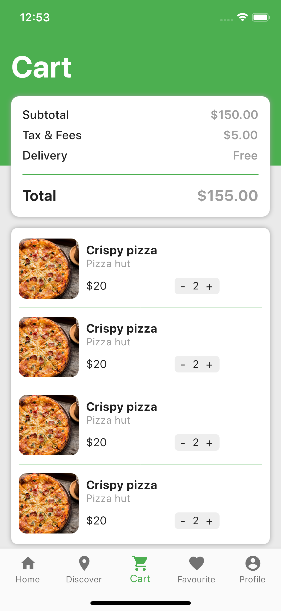
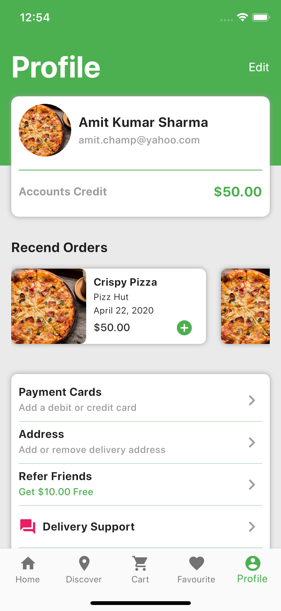
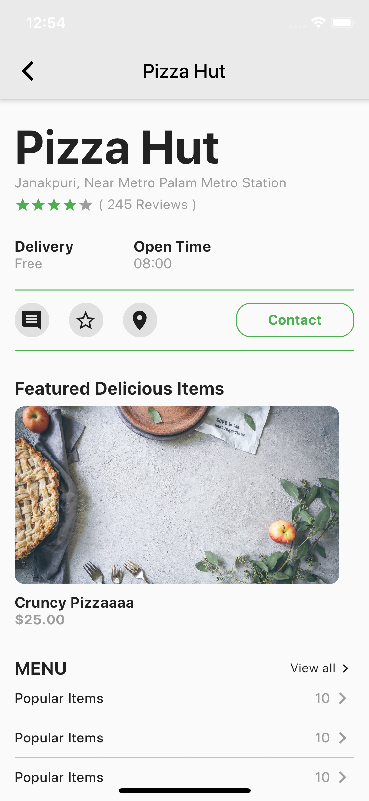
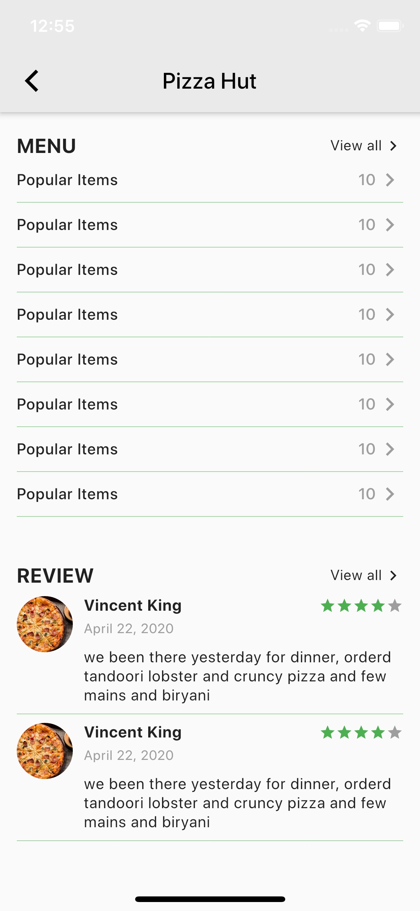
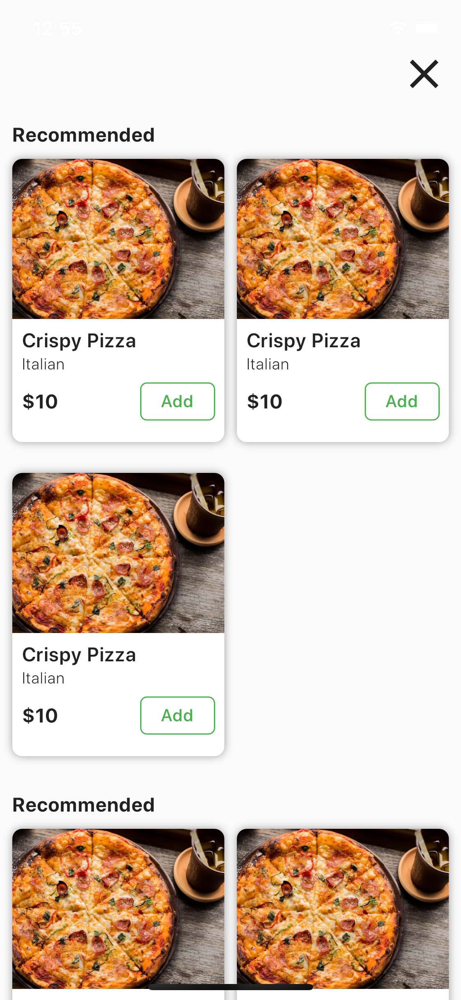

# foody-lover
Clean &amp; Beautiful App design for food delivery(like swiggy) in Flutter

<h2>Screenshots</h2>
<h4>Homepage</h4>

<h4>Restaurant List</h4>

<h4>Favourite</h4>

<h4>Cart</h4>

<h4>Profiled</h4>

<h4>Restaurant Details</h4>

<h4>Restaurant Menu</h4>

<h2>Credits</h2>
<h3>Images</h3>

https://unsplash.com/images/food

